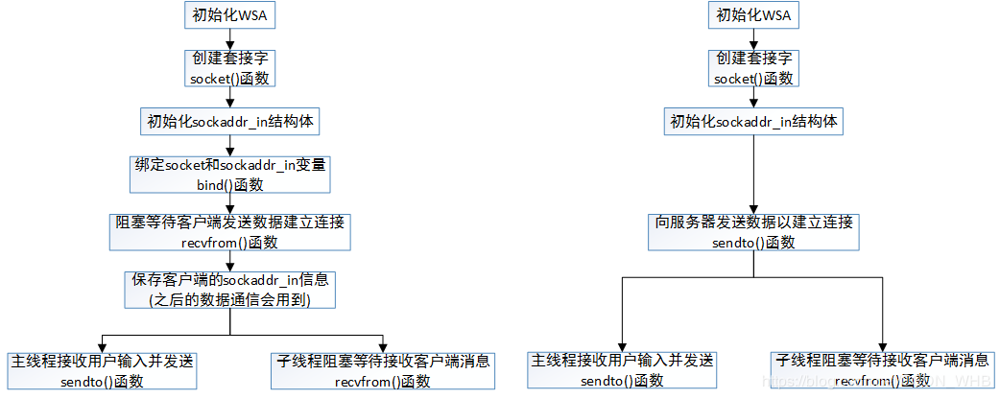
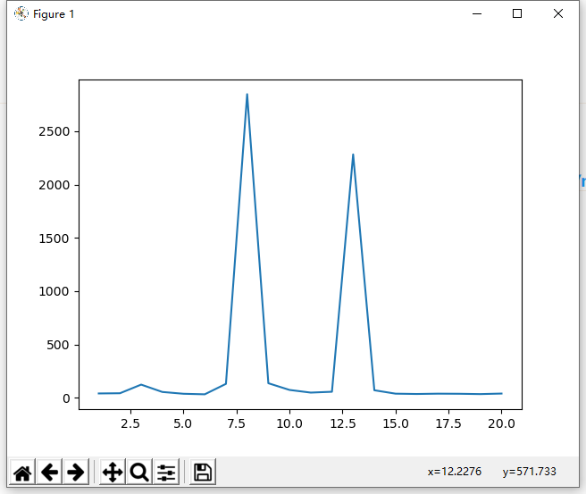
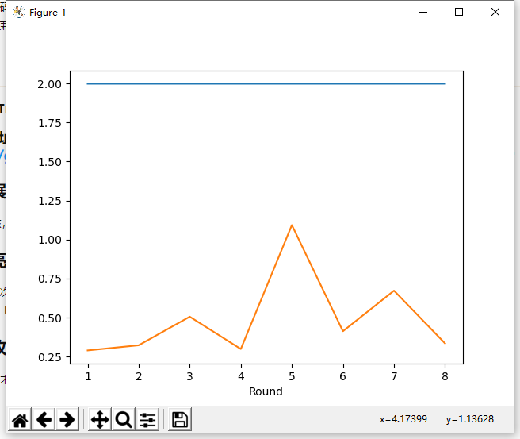

### SoftlyNetTest

#### C++ No.4 网络测速器

- [x] 弄懂智能指针shared_ptr和unique_ptr
- [x] 弄懂socket
- [x] socket服务器和客户端
- [x] cxxopts命令行
- [x] 弄懂Udp
- [x] 定义消息格式
- [x] 完成RTT
- [x] 绘制RTT曲线图
- [x] 完成带宽测试
- [ ] 适配linux
- [x] 绘制带宽结果图
- [x] 改进绘制效果

